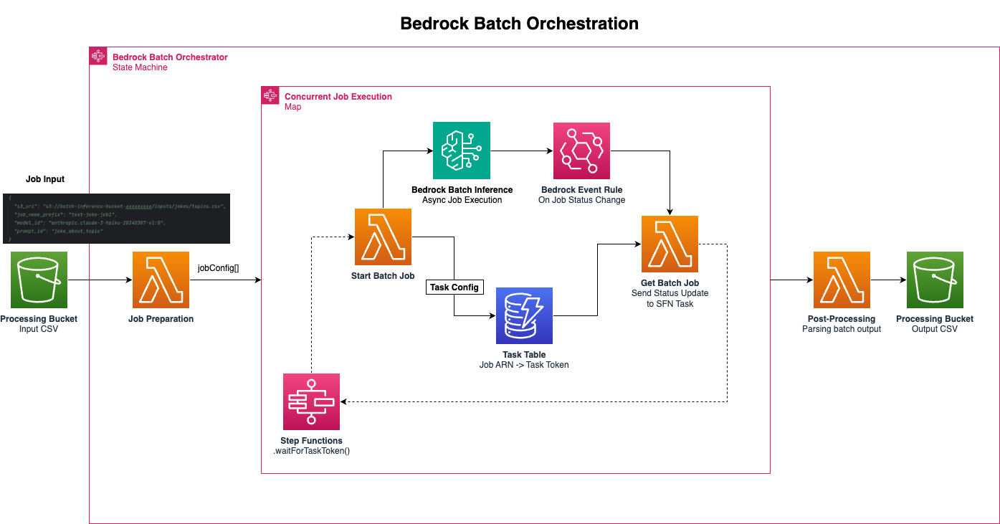
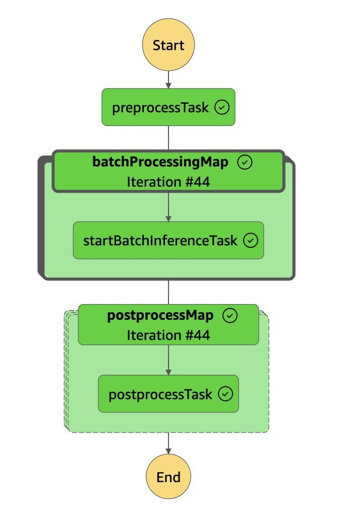
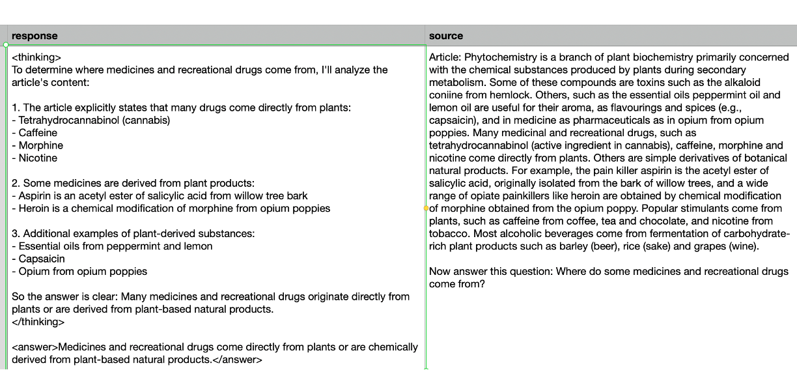
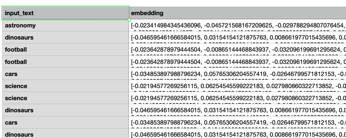

# Bedrock Batch Job Orchestration

A flexible, scalable framework for orchestration of [**Bedrock Batch Inference**](https://docs.aws.amazon.com/bedrock/latest/userguide/batch-inference.html) via AWS Step Functions.

## Overview

For very large-scale (>>1,000 records), time-insensitive foundation model-based processing (including LLM's and embedding models), [**Bedrock Batch Inference**](https://docs.aws.amazon.com/bedrock/latest/userguide/batch-inference.html) is a cost-effective alternative to the on-demand Bedrock endpoints. It allows you to submit large batches of prompts/input records into asynchronous model invocation jobs, which process the requests at a 50% discount compared to on-demand. Jobs are put in a first-come-first-serve queue, and while there is no guaranteed SLA for batch jobs, they are typically returned within hours, depending on the batch size and model demand.

Batch inference makes the most sense for very large scale jobs, but it comes with a bit of overhead compared to simple InvokeModel requests to the on-demand endpoints.

## Key Challenges

First, job inputs have to be structured in a particular way, as JSONL files with a line for each input record, matching the API request structure for that foundation model (FM) / provider. For example, [Anthropic Claude](https://docs.aws.amazon.com/bedrock/latest/userguide/model-parameters-anthropic-claude-messages.html) models have a different JSON structure compared to [Titan-V2 text embeddings](https://docs.aws.amazon.com/bedrock/latest/userguide/model-parameters-titan-embed-text.html). There are also quotas representing the minimum (currently defaults to 1,000) and maximum (50,000) number of records per batch.

Next, orchestration of the asynchronous, long-running jobs requires clients to maintain an inventory of which individual jobs are associated to a given run. There is also a quota related to the maximum number of concurrent in-progress job executions at a given time.

> For example, if you have a job performing sentiment analysis on 500K tweets, that means you will need to execute at least 500K / 50K => 10 individual batch inference jobs. If the quota for the maximum number of concurrent jobs is only 5, you will need to manage this capacity efficiently (and ideally, in an automated fashion).

Finally, you will likely want to perform some light post-processing on the batch outputs (another large JSONL file) in order to parse the responses and join the output back to the original input, if necessary (e.g. given some text to embed, you will need a way to link the output vector back to the original text).

**Solution**

This artifact provides a flexible and scalable framework to simplify batch orchestration. Given a simple configuration input (including the S3 URI to input files OR a Hugging Face dataset ID, model ID, and prompt ID) and the State Machine deployed in this AWS CDK Stack will handle the following:

- **Pre-Processing** of input datasets to prepare batch job inputs for your particular model ID and prompt template. The [`BaseProcessor`](lambda/processor.py) abstract class can easily be extended for any model provider, such as Llama 3 or AI21 Labs.
- **Orchestration** of batch jobs in an event-driven fashion. We maintain an internal inventory of jobs in a DynamoDB table and keep it updated when Bedrock emits events related to job status changes. These updates are then transmitted back to the step function via the ["Wait for Task Token Callback" integration pattern](https://docs.aws.amazon.com/step-functions/latest/dg/connect-to-resource.html#connect-wait-token). Using a SFN Map, we ensure that the maximum capacity of concurrent jobs is maintained until all records have been processed.
- **Post-Processing** of batch outputs to perform some light parsing and join model responses back to the original input data.



## Quickstart

Follow these steps to deploy the CDK stack to your AWS environment.

## Prerequisites

- `node` & `npm`
- AWS CDK (`npm install -g aws-cdk`)

1. Clone this repository into your local development environment and `cd` into this folder.

`git clone https://github.com/aws-samples/amazon-bedrock-samples.git && cd amazon-bedrock-samples/poc-to-prod/bedrock-batch-orchestrator`

2. Install the required packages.

`npm i`

3. Run the automated test suites.

   - Jest/CDK tests: `npm test`
   - Python unit tests for Lambda utilities: `python -m unittest discover -s lambda/tests -p 'test_*.py'`

4. Check the [`prompt_templates.py`](lambda/prompt_templates.py) file and add a new prompt template to `prompt_id_to_template` for your desired use case.

`prompt_id_to_template` is a dict where the key is the `prompt_id` (allowing you to associate a given job with a particular prompt). Keep in mind that any formatting keys in the prompt string template will need to also exist in your input file. For example, given the prompt template

`Tell me a joke about {topic} in less than 50 words.`

You will need to make sure that your input dataset has a column for each formatting key (e.g. `topic` in the example above).

Note that prompt templates are not used for embedding model-based jobs.

5. (Recommended) Run `npm run cdk -- synth` to synthesize the AWS CloudFormation template that will be deployed. This lets you review the generated infrastructure-as-code output before provisioning anything in your account.

6. (First time per account/region) Bootstrap the AWS environment so the CDK can provision resources. Replace `<ACCOUNT_ID>` and `<REGION>` with your deployment target.

`npm run cdk -- bootstrap aws://<ACCOUNT_ID>/<REGION>`

Bootstrapping deploys the shared `CDKToolkit` stack that CDK apps depend on—it provisions an S3 bucket (template/assets storage), an ECR repo (Docker assets), deployment roles, and registers the bootstrap version in SSM Parameter Store. Run it once per account/region before your first deploy.

7. Deploy the CDK stack.

`npm run cdk -- deploy`

For verbose streaming of CloudFormation events (helpful if a step seems hung), use `npm run cdk -- deploy --progress events`.

Take note of the CFN Outputs denoting the names of the bucket and step function:

```
✅  BedrockBatchInferenceProcessingStack

✨  Deployment time: 23.16s

Outputs:
BedrockBatchInferenceProcessingStack.bucketName = batch-inference-bucket-<YOUR_ACCOUNT_ID>
BedrockBatchInferenceProcessingStack.stepFunctionName = bedrockBatchInferenceProcessingSfnE5E2B976-4yznxekguxxm
Stack ARN:
arn:aws:cloudformation:us-east-1:<YOUR_ACCOUNT_ID>:stack/BedrockBatchInferenceProcessingStack/0787ba80-b0cb-11ef-a481-0affd4b49c99

✨  Total time: 26.74s
```

8. As your input dataset, you can either use a Hugging Face dataset ID or point directly to a dataset in S3 (CSV or parquet formats are currently supported).

**Hugging Face Dataset**

Reference a dataset ID, e.g. [`w601sxs/simpleCoT`](https://huggingface.co/datasets/w601sxs/simpleCoT), and your dataset will be pulled directly from Hugging Face Hub.

**S3 Dataset**

Upload an input CSV or parquet file to the S3 bucket and copy the S3 URI.

e.g. `aws s3 cp topics.csv s3://batch-inference-bucket-<YOUR_ACCOUNT_ID>/inputs/jokes/topics.csv`

9. Open up your step function in AWS Console and submit an input with the following structure. You either need to supply a `dataset_id` and `split` (for Hugging Face datasets) or an `s3_uri` (for S3 datasets):

e.g. for Anthropic Models with an S3 Input:

```json
{
  "s3_uri": "s3://batch-inference-bucket-<YOUR_ACCOUNT_ID>/inputs/jokes/topics.csv",
  "job_name_prefix": "test-joke-job1",
  "model_id": "anthropic.claude-3-haiku-20240307-v1:0",
  "prompt_id": "joke_about_topic"
}
```

Note that the `prompt_id` of `joke_about_topic` maps to a prompt template in [`prompt_templates.py`](lambda/prompt_templates.py) which has a formatting key for `topic`, which must be one of the columns in the input CSV file.

e.g. for a Hugging Face dataset

```json
{
  "dataset_id": "w601sxs/simpleCoT",
  "split": "train",
  "job_name_prefix": "test-cot-job-1",
  "model_id": "us.anthropic.claude-3-5-haiku-20241022-v1:0",
  "prompt_id": "question_answering",
  "max_num_jobs": 1
}
```

For a quick smoke test that stays within free credits, run:

```json
{
  "dataset_id": "w601sxs/simpleCoT",
  "split": "train",
  "job_name_prefix": "demo-run-001",
  "model_id": "anthropic.claude-3-haiku-20240307-v1:0",
  "prompt_id": "question_answering",
  "max_num_jobs": 1,
  "max_records_total": 100
}
```

Note that we supplied a `dataset_id` and `split` to reference. The `question_answering` prompt template in [`prompt_templates.py`](lambda/prompt_templates.py) has a formatting key called `source` to match the name of the appropriate column in the referenced [dataset](https://huggingface.co/datasets/w601sxs/simpleCoT).

We also have optional keys for `max_num_jobs` (to limit the total number of jobs - useful for testing on a smaller scale) and `max_records_per_batch`.

By default the preprocessing Lambda processes **all** records in the dataset.

### Discovering Available Models

Use the AWS CLI to check which Bedrock models are available in your target region:

```
aws bedrock list-foundation-models --region <REGION> --output table
```

To list only models your account currently has access to:

```
aws bedrock list-foundation-models \
    --region <REGION> \
    --query "modelSummaries[?modelAccessType=='GRANTED'].[{Id:modelId, Provider:providerName, ModelAccessType:modelAccessType}]" \
    --output table
```

For the Zurich region specifically:

``
aws bedrock list-foundation-models \
    --region eu-central-2 \
    --query "modelSummaries[?modelAccessType=='GRANTED'].[{Id:modelId, Provider:providerName, ModelAccessType:modelAccessType}]" \
    --output table
```

To inspect a specific model for its ARN and metadata:

```
aws bedrock get-foundation-model --model-identifier <MODEL_ID> --region <REGION>
```

Provide `max_records_total` (or set the `MAX_TOTAL_RECORDS` environment variable before deployment) if you want to cap the number of records for smoke tests or cost-control purposes.

> **Regional Lambda quotas:**
Some regions (for example `eu-central-2`) enforce a 3 GB memory ceiling for Lambda functions on new accounts. The stack defaults the preprocess/postprocess functions to 3008 MB to avoid deployment failures. If your account has a higher quota, override it via CDK context: `npm run cdk -- deploy --context preprocessFunctionMemoryMb=6000 --context postprocessFunctionMemoryMb=6000`.

To generate embeddings with a model like Titan-V2 embeddings, you do not need to provide a `prompt_id`, but you do need to ensure that your input CSV file has a column called `input_text` with the text you would like to embed.

```json
{
  "s3_uri": "s3://batch-inference-bucket-<YOUR_ACCOUNT_ID>/inputs/embeddings/embedding_input.csv",
  "job_name_prefix": "test-embeddings-job1",
  "model_id": "amazon.titan-embed-text-v2:0",
  "prompt_id": null
}
```

### Step Function Input Schema

The state machine expects a JSON payload with the following shape:

| Field | Type | Required | Notes |
| --- | --- | --- | --- |
| `job_name_prefix` | string | ✅ | Used to construct unique batch job names. |
| `model_id` | string | ✅ | Must map to a processor in `lambda/processor.py`. |
| `s3_uri` | string | ✅* | Required unless `dataset_id` is provided. Points to CSV/Parquet input with headers. |
| `dataset_id` | string | ✅* | Optional alternative to `s3_uri`. If set, supplies a Hugging Face dataset ID. |
| `split` | string | optional | Hugging Face split (defaults to `train`). Ignored when `s3_uri` is used. |
| `prompt_id` | string | ✅ for text models | Must match a key in `prompt_templates.prompt_id_to_template`. Omit or set `null` for embedding models. |
| `max_records_total` | integer | optional | Caps total records processed. When omitted, all rows are processed. Set via input or `MAX_TOTAL_RECORDS`. |
| `max_num_jobs` | integer | optional | Limits total jobs emitted (useful for testing alongside `max_records_total`). |
| `max_records_per_job` | integer | optional | Overrides chunk size (defaults to env `MAX_RECORDS_PER_JOB`, 1000). |

Additional validation rules enforced during preprocessing:

- Exactly one of `dataset_id` or `s3_uri` must be supplied.
- Embedding models require an `input_text` column in the source data.
- Text models require all template placeholders (for example `{topic}`) to exist as columns. Missing fields fail fast with a clear error.
- `prompt_id` must be defined for text models; it can be `null` only when the processor type is `embedding`.

**Note: Currently, the only supported models in this codebase are the Anthropic family and Titan-V2 embeddings. Extending to other providers is simply a matter of updating [`processor.py`](lambda/processor.py) with a new `BaseProcessor` class that implements the `process_input` and `process_output` functions according to the signature in the abstract method. You will also need to update the logic in `get_processor_for_model_id` to associate a given model ID with your new `BaseProcessor`.**



Monitor your step function as it runs the job(s). **The max number of submitted and in-progress jobs is controlled by a CDK context variable in [`cdk.json`](cdk.json) (key: `maxSubmittedAndInProgressJobs`)**. The paths to your resulting CSV file(s) will be aggregated in the outputs from the execution.

The output CSV file(s) will contain all the same columns as your input file.

For text-based models, the output string will be in a new column called `response`:



For embedding models, the output (list of floats) will be in a new column called `embedding`



## Retrieve Results Locally

The stack stores JSONL outputs under `s3://<bucket>/batch_outputs_json/<job_prefix>/` and merged Parquet files under `s3://<bucket>/batch_output_parquet/<job_prefix>/`.

Use the helper script to sync them to your machine (requires the AWS CLI and appropriate permissions):

```bash
scripts/download_results.sh <bucket-name> <job-prefix> [destination-dir]
# Example
scripts/download_results.sh batch-inference-bucket-123456789012 my-test-run outputs/my-test-run
```

The script will mirror both the JSON and Parquet outputs into the specified destination (defaulting to `downloads/<job-prefix>`).
